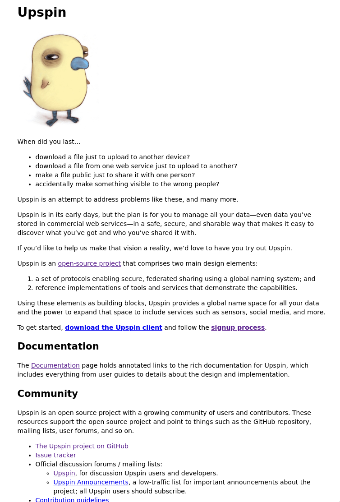
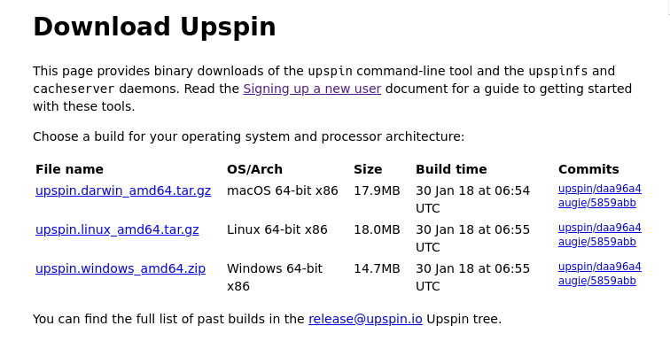

1. Go to [homepage](https://upspin.io/)



1. Go to [download the Upspin client](https://upspin.io/dl/)



1. `wget https://upspin.io/dl/upspin.linux_amd64.tar.gz`
1. `tar -xf upspin.linux_amd64.tar.gz`
1. ```$ ls
cacheserver  README  upspin  upspin-audit  upspinfs  upspin.linux_amd64.tar.gz  upspin-ui```
1. Go to [Signing up a new user](https://upspin.io/doc/signup.md)
1.
